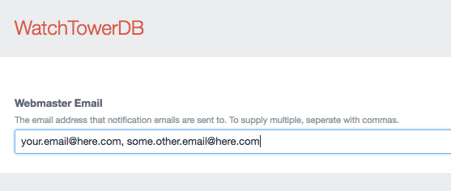

# WatchTowerDB plugin for Craft CMS

A CraftCMS logging system derived from my CodeIgniter based WatchTowerDB-CI logging system (https://github.com/JamesMcFall/WatchTowerDB-CI-Logging).


## Installation

To install WatchTowerDB, follow these steps:

1. Download & unzip the file and place the `watchtowerdb` directory into your `craft/plugins` directory
2.  -OR- do a `git clone https://github.com/https://github.com/JamesMcFall/WatchTower-CraftCMS/watchtowerdb.git` directly into your `craft/plugins` folder.  You can then update it with `git pull`
3. Install plugin in the Craft Control Panel under Settings > Plugins
4. The plugin folder should be named `watchtowerdb` for Craft to see it.  GitHub recently started appending `-master` (the branch name) to the name of the folder for zip file downloads.

WatchTowerDB works on Craft 2.4.x and Craft 2.5.x.

## WatchTowerDB Overview

-Insert text here-

## Configuring WatchTowerDB

After WatchTowerDB has been installed, go into the plugin settings and set the email address you want error emails to go to.



## Using WatchTowerDB

### Basic logging

Logging is very straightforward. The first parameter specifies which stream (analogous to a log file or category of errors) you want to write into (note if the log stream doesn't exist, it will be created automatically). The second parameter is the message to put in the log stream.

```php
# Note the first parameter is the logging stream (ie an individual log)
craft()->watchTowerDB->log("registration", "Oh no. Steve tried to enrol again. Don't worry, we stopped him!");
```

### Sending a notification email out when an error is logged.
If you want to notify the webmaster(s) when a particular kind of error is logged, the fourth parameter (a boolean) should be passed as true;

```php
# Note the fourth parameter is now "true". This is the "Notify" parameter.
craft()->watchTowerDB->log("registration", "Oh no. Steve tried to enrol again. Don't worry, we stopped him!", null, true);
```

### Logging Extra Debugging Info

If you want to include more information

```php
# Note the third parameter is an optional variable (i.e. an object or array) that will be saved to the database.

$extraInfo = [
    "registrationFormData" => $_POST,
    "likesCake" => true,
];

craft()->watchTowerDB->log("registration", "Oh no. Steve tried to enrol again. Don't worry, we stopped him!", $extraInfo);
```


## WatchTowerDB Roadmap

Some things to do, and ideas for potential features:

@todo

## WatchTowerDB Changelog

### 0.1 -- 2016.05.16

* Initial release

Brought to you by [James McFall](http://mcfall.geek.nz)